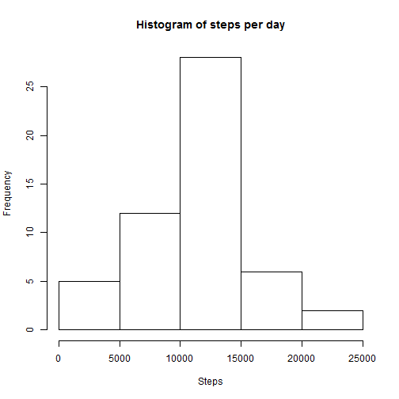
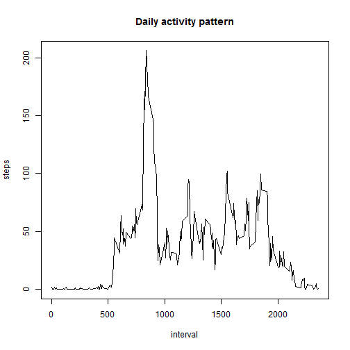
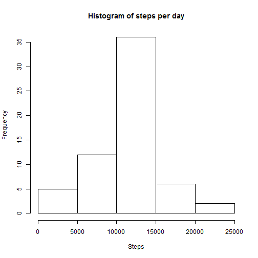
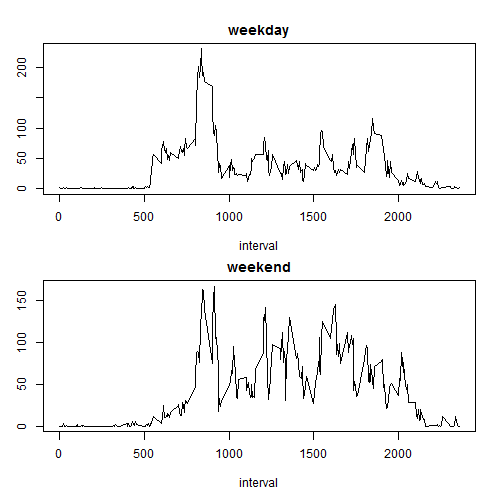

---
title: "Reproducible Research: Peer Assessment 1"
output: 
  html_document:
    keep_md: true
---


## Loading and preprocessing the data
First we unzip and read data.

```r
unzip("activity.zip")
rawdata <- read.csv("activity.csv")
```


## What is mean total number of steps taken per day?
Let's calculate the total number of steps taken per day and make a histogram.

```r
stepsbyday <- aggregate(steps ~ date, data = rawdata, FUN = sum)
hist(stepsbyday$steps, main = "Histogram of steps per day", xlab = "Steps")
```

 

After that we calculate and report the mean and median of the total number of steps taken per day.

```r
c(mean(stepsbyday$steps),median(stepsbyday$steps))
```

```
## [1] 10766.19 10765.00
```

## What is the average daily activity pattern?
Let's make a time series plot of the 5-minute interval (x-axis) and the average number of steps taken, averaged across all days (y-axis).

```r
stepsbyinterval <- aggregate(steps ~ interval, data = rawdata, FUN = mean)
plot(stepsbyinterval, type = "l", main = "Daily activity pattern")
```

 

We see that interval starting at 8:35 contains the maximum number of steps on average across all the days in the dataset.

```r
stepsbyinterval[stepsbyinterval$steps == max(stepsbyinterval$steps),"interval"]
```

```
## [1] 835
```

## Imputing missing values
Let's see how many rows have NAs.

```r
nrow(rawdata[is.na(rawdata$steps),])
```

```
## [1] 2304
```

Let's create a new dataset that is equal to the original dataset but with the missing data filled in. We will replace NAs with rounded mean for that interval.

```r
tidydata <- merge(rawdata, stepsbyinterval, by.x = "interval", by.y = "interval")
names(tidydata) <- c("interval", "steps", "date", "mean")
tidydata[is.na(tidydata$steps),"steps"] <- round(tidydata[is.na(tidydata$steps),"mean"])
```

Let's make a histogram of the total number of steps taken each day. 

```r
stepsbydaytidy <- aggregate(steps ~ date, data = tidydata, FUN = sum)
hist(stepsbydaytidy$steps, main = "Histogram of steps per day", xlab = "Steps")
```

 

Let's see again mean and median total number of steps taken per day.

```r
c(mean(stepsbydaytidy$steps),median(stepsbydaytidy$steps))
```

```
## [1] 10765.64 10762.00
```

We see that replacing NAs with means slightly decreased numbers compared to the ones from the first part of the assignment.

## Are there differences in activity patterns between weekdays and weekends?
Let's create a new factor variable in the dataset with two levels - "weekday" and "weekend" indicating whether a given date is a weekday or weekend day.

```r
weekdayflag <- factor(weekdays(as.Date(tidydata$date)))
```

```
## Warning in strptime(xx, f <- "%Y-%m-%d", tz = "GMT"): unable to identify current timezone 'B':
## please set environment variable 'TZ'
```

```
## Warning in strptime(xx, f <- "%Y-%m-%d", tz = "GMT"): unknown timezone
## 'localtime'
```

```r
levels(weekdayflag) <- c("weekday", "weekday", "weekend", "weekend", "weekday", "weekday", "weekday")
```

Finally let's make a panel plot containing a time series plot  of the 5-minute interval (x-axis) and the average number of steps taken, averaged across all weekday days or weekend days (y-axis).

```r
stepsbyintervaltidy <- aggregate(steps ~ interval + weekdayflag, data = cbind(tidydata,weekdayflag), FUN = mean)
par(mfrow = c(2,1))
par(mar = c(4,2,2,1))
par(oma = c(1,1,1,1))
plot(stepsbyintervaltidy[stepsbyintervaltidy$weekdayflag == "weekday","interval"],stepsbyintervaltidy[stepsbyintervaltidy$weekdayflag == "weekday","steps"], type = "l", main = "weekday", xlab = "interval", ylab = "steps, avg.")
plot(stepsbyintervaltidy[stepsbyintervaltidy$weekdayflag == "weekend","interval"],stepsbyintervaltidy[stepsbyintervaltidy$weekdayflag == "weekend","steps"], type = "l", main = "weekend", xlab = "interval", ylab = "steps, avg.")
```

 
